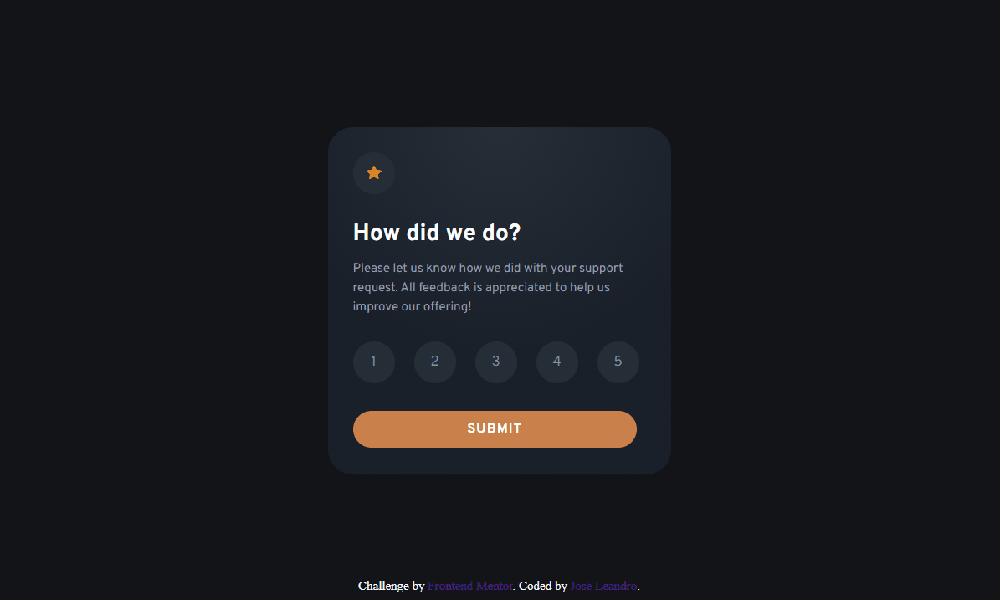

# Frontend Mentor - Interactive rating component solution

Essa é a minha solução para [Huddle landing page with single introductory section challenge on Frontend Mentor](https://www.frontendmentor.io/challenges/interactive-rating-component-koxpeBUmI).

This is a solution to the [Interactive rating component challenge on Frontend Mentor](https://www.frontendmentor.io/challenges/interactive-rating-component-koxpeBUmI). Frontend Mentor challenges help you improve your coding skills by building realistic projects. 

## Conteúdos / Table of contents

- [Visão geral / Overview](#overview)
  - [O desafio / The challenge](#the-challenge)
  - [Gif](#gif)
  - [Links](#links)
- [Meu processo / My process](#my-process)
  - [Feito com / Built with](#built-with)
  - [O que eu aprendi / What I learned](#what-i-learned)
- [Autor / Author](#author)

## Visão Geral

#### Overview

Nesse desafio há alguns pontos chaves como:

- Posição de elementos / Elements position
- Manipulação na lista de classes dos elementos / Manipulation in the class list of elements
- Observadores de eventos / Events listeners

### O desafio 

##### The challenge

O usuário deve ser capaz de:

- Ver o melhor layout possivel dependendo do dispositivo / View the optimal layout for the app depending on their device's screen size
- Estados de hover para elementos / Hover states for elementos
- Selecionar e enviar uma nota em número / Select and submit a number rating
- Ver o cartão "Thank you" após enviar uma nota / See the "Thank you" card state after submitting a rating

### Gif

### Links

- Link da minha soluçã / Solution URL: [Repositório GitHub](https://github.com/Leandro-Sousa-dev/interactive-rating-component)
- Link do site hospedado / Live Site URL: [Site hospedado Github pages](https://leandro-sousa-dev.github.io/interactive-rating-component/)

## Meu processo

#### My process

Meu processo para a estrutura foi pensar nos containers de cada elemento, fazer a estrutura html baseado nisso, só então pensar nos estilos e posicionamento.

/ My process for the structure was to think about the containers for each element, make the html structure based on that, then think about styles and element position.

No javaScript eu dividi o problema em quatro etapas:
/ On javaScript I divided the problem into four steps:

- Modificar o label selecionado / Modify the selected label
- Ativar o botão de enviar / Enable the submmit button
- Modificar o cartão selecionado / Modify selected card
- Modificar as informações do cartão "thanks" / Modify the infos at card thanks

### Feito com

##### Built with

- Tags HTML5 semâticas / Semantic HTML5 markup
- Propriedades CSS costumizadas / CSS custom properties
- CSS flex
- JavaScript

### O que eu aprendi

##### What I learned

Nesse projeto treinei a modificação de elementos usando javaScript / In this project I trained modifying elements using JavaScript.

## Autor

#### Author

- GitHub - [Leandro-Sousa-dev](https://github.com/Leandro-Sousa-dev)
- Frontend Mentor - [@Leandro-Sousa-dev](https://www.frontendmentor.io/profile/Leandro-Sousa-dev)
- LinkedIn - [José Leandro](https://www.linkedin.com/in/jos%C3%A9-leandro-7ba007261/)

